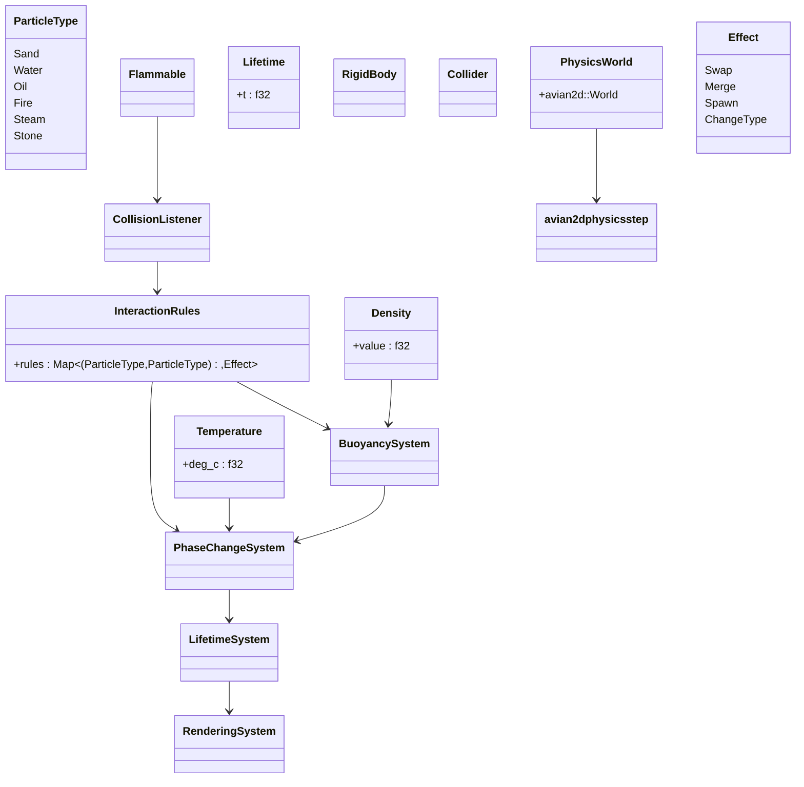
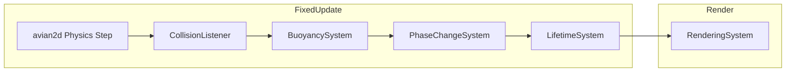

# Powder Game - Bevy Edition

Inspired by the original [Powder Game](https://dan-ball.jp/en/javagame/dust/),
 [The Powder Toy](https://powdertoy.co.uk/), and
[Sandspiel](https://sandspiel.club/), this project aims to recreate the game
using the Bevy game engine. The goal is to provide a similar experience with
enhanced features and performance. It is a learning project for Bevy and Rust,
focusing on game development, physics simulation, and user interaction.

This game is created as part of [Bevy Jam 6](https://itch.io/jam/bevy-jam-6).

## 1. Components & Resources



* **ParticleType**, **Density**, **Temperature**, **Flammable**, **Lifetime**
  trait and metadata components remain unchanged.
* **RigidBody**, **Collider**
  avian2d’s core components for movement & collision.
* **PhysicsWorld**
  holds the avian2d simulation.
* **InteractionRules** + **Effect**
  central data-driven mapping of interactions.

## 2. System Pipeline



1. **avian2d Physics Step**
   integrates bodies, handles collisions.
2. **CollisionListener**
   on collision start, looks up `(typeA,typeB)` in `InteractionRules` and `apply_effect`.
3. **BuoyancySystem** (optional)
   for non-collision density swaps (e.g. oil on water).
4. **PhaseChangeSystem**
   converts water→steam, oil→fire, etc.
5. **LifetimeSystem**
   despawns consumed/expired entities.
6. **RenderingSystem**
   syncs transforms & draws sprites.

## 3. Example Rules

```rust
let mut rules = InteractionRules::default();

// Oil floats on water
rules.insert(
    (ParticleType::Oil, ParticleType::Water),
    Effect::Swap,
);

// Oil burns to fire
rules.insert(
    (ParticleType::Oil, ParticleType::Fire),
    Effect::ChangeType(ParticleType::Fire),
);

// Water → Steam on fire
rules.insert(
    (ParticleType::Water, ParticleType::Fire),
    Effect::ChangeType(ParticleType::Steam),
);
```

Hook these in the `collision_listener` system:

```rust
fn collision_listener(
    mut events: EventReader<CollisionEvent>,
    rules: Res<InteractionRules>,
    mut commands: Commands,
) {
    for CollisionEvent(a, b, started) in events.iter() {
        if !started { continue; }
        if let Some(effect) = rules.rules.get(&(a.type, b.type)) {
            apply_effect(effect, &mut commands, a, b);
        }
    }
}
```

## 4. Four-Hour Priorities

1. **avian2d Wiring**
   – Add `RigidBody`, `Collider` components & `PhysicsWorld` resource.
   – Hook avian2d plugin into your Bevy app.
2. **Collision Listener**
   – Read collision events and `InteractionRules`.
3. **First Interaction**
   – Implement oil/water swap rule. Verify in–game.
4. **Layer Effects**
   – Add combustion (oil→fire) and steam rules.
5. **Rendering**
   – Minimal sprite or colored quad per body, synced from avian2d transforms.

> Leverage avian2d for low-level movement/collision; keep your ECS focused on game-specific behaviors.
